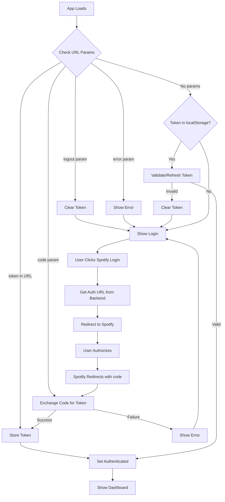

# Authentication Flow Analysis & Dashboard Navigation Plan

## Executive Summary

The application **already has a working authentication flow** that should display the Dashboard after successful Spotify authentication. The routing is handled via conditional rendering based on authentication state, not React Router.

---

## 1. Current Routing Mechanism

### No React Router - State-Based Conditional Rendering

The app uses a simple conditional rendering pattern in [`App.tsx`](frontend/src/App.tsx:163-167):

```tsx
{isAuthenticated ? (
  <Dashboard />
) : (
  <Login onLoginSuccess={handleLoginSuccess} externalError={authError} />
)}
```

**Key Points:**
- No client-side routing library is used
- Page switching is controlled entirely by the `isAuthenticated` state
- URL changes are handled via `window.history.replaceState()` for cleanup only

---

## 2. Authentication State Management

### State Variables in [`App.tsx`](frontend/src/App.tsx:8-11)

```tsx
const [isAuthenticated, setIsAuthenticated] = React.useState(false);
const [isLoading, setIsLoading] = React.useState(true);
const [authError, setAuthError] = React.useState<string | null>(null);
const exchangeInProgress = React.useRef(false);
```

### Token Storage

- **Storage Key:** `harmonytrack_token`
- **Location:** `localStorage`
- **Additional Keys:**
  - `harmonytrack_user` - Demo user data
  - `harmonytrack_warning` - Spotify 403 warning flag

---

## 3. Authentication Flow Diagram



---

## 4. Detailed Flow Analysis

### 4.1 Initial App Load - [`App.tsx`](frontend/src/App.tsx:13-122)

The `useEffect` hook runs on mount and checks:

1. **Logout Param** - Forces logout and clears storage
2. **Error Param** - Displays authentication errors
3. **Token in URL** - Direct token injection for demo mode
4. **Code Param** - Spotify OAuth callback handling
5. **Existing Token** - Validates stored token with backend

### 4.2 Spotify Login Flow - [`Login.tsx`](frontend/src/pages/Login.tsx:63-100)

```tsx
const handleSpotifyLogin = async () => {
  const response = await axios.get(`${API_URL}/api/auth/spotify/login`);
  if (response.data.authUrl) {
    window.location.href = response.data.authUrl;  // Redirect to Spotify
  }
};
```

### 4.3 OAuth Callback Handling - [`App.tsx`](frontend/src/App.tsx:49-84)

When Spotify redirects back with a `code`:

```tsx
if (code && (path === '/callback' || path === '/') && !exchangeInProgress.current) {
  exchangeInProgress.current = true;
  window.history.replaceState({}, document.title, '/');  // Clean URL
  
  const response = await axios.post('http://127.0.0.1:8081/api/auth/spotify/exchange', { code });
  const { token, warning } = response.data;
  
  if (token) {
    localStorage.setItem('harmonytrack_token', token);
    setIsAuthenticated(true);  // This triggers Dashboard render
  }
}
```

### 4.4 Demo Mode - [`Login.tsx`](frontend/src/pages/Login.tsx:102-116)

```tsx
const handleDemoLogin = () => {
  const demoToken = 'demo_token_' + Date.now();
  localStorage.setItem('harmonytrack_token', demoToken);
  onLoginSuccess();  // Sets isAuthenticated = true
  window.location.href = '/';  // Full page reload
};
```

---

## 5. API Service Architecture - [`api.ts`](frontend/src/services/api.ts)

### Axios Instance Configuration

```tsx
const api = axios.create({
  baseURL: API_URL,
  timeout: 10000,
});
```

### Request Interceptor - Auto JWT Injection

```tsx
api.interceptors.request.use((config) => {
  const token = localStorage.getItem('harmonytrack_token');
  if (token) {
    config.headers.Authorization = `Bearer ${token}`;
  }
  return config;
});
```

### Response Interceptor - Auto Token Refresh

Handles 401 errors with automatic token refresh:

```tsx
api.interceptors.response.use(
  (response) => response,
  async (error) => {
    if (error.response?.status === 401 && error.response?.data?.error === 'token_expired') {
      // Refresh token and retry original request
    }
  }
);
```

---

## 6. Dashboard Component - [`Dashboard.tsx`](frontend/src/pages/Dashboard.tsx)

### Data Fetching

The Dashboard fetches data on mount:

```tsx
useEffect(() => {
  if (isDemoMode()) {
    // Use mock data
    setProfile(mockProfile);
    setTopTracks(mockTopTracks);
    // ...
    setLoading(false);
    return;
  }
  
  // Fetch real Spotify data
  const [profileRes, topShortRes, ...] = await Promise.allSettled([
    spotifyService.getProfile(),
    spotifyService.getTopTracks('short_term', 20),
    // ...
  ]);
}, []);
```

### Demo Mode Detection - [`mockSpotifyData.ts`](frontend/src/data/mockSpotifyData.ts)

```tsx
export function isDemoMode(): boolean {
  const token = localStorage.getItem('harmonytrack_token');
  return token?.startsWith('demo_token_') ?? false;
}
```

---

## 7. Current State Assessment

### ✅ What Works

1. **Authentication flow is complete** - Spotify OAuth → Code exchange → Token storage → Dashboard display
2. **Token persistence** - Stored in localStorage, survives page refreshes
3. **Auto-refresh** - JWT tokens are automatically refreshed on 401 errors
4. **Demo mode** - Works without Spotify connection
5. **Error handling** - Displays errors for failed authentication

### ⚠️ Potential Issues

1. **No React Router** - Cannot navigate to specific routes like `/dashboard` directly
2. **Full page reloads** - Demo mode uses `window.location.href = '/'` causing full reload
3. **URL cleanup** - OAuth callback URL is immediately cleaned, losing browser history

---

## 8. Implementation Plan

### Scenario A: Dashboard Not Showing After Auth

If the Dashboard is not appearing after authentication, check:

1. **Backend is running** on `http://127.0.0.1:8081`
2. **Token exchange endpoint** returns valid token
3. **Check browser console** for errors
4. **Verify localStorage** contains `harmonytrack_token`

### Scenario B: Add Proper Routing with React Router

If the user wants proper URL-based navigation:

#### Step 1: Install React Router
```bash
npm install react-router-dom
```

#### Step 2: Update App.tsx
```tsx
import { BrowserRouter, Routes, Route, Navigate } from 'react-router-dom';

function App() {
  const [isAuthenticated, setIsAuthenticated] = React.useState(false);
  
  return (
    <BrowserRouter>
      <Routes>
        <Route 
          path="/login" 
          element={
            isAuthenticated ? 
              <Navigate to="/dashboard" replace /> : 
              <Login onLoginSuccess={() => setIsAuthenticated(true)} />
          } 
        />
        <Route 
          path="/dashboard" 
          element={
            isAuthenticated ? 
              <Dashboard /> : 
              <Navigate to="/login" replace />
          } 
        />
        <Route 
          path="/callback" 
          element={<CallbackHandler setIsAuthenticated={setIsAuthenticated} />} 
        />
        <Route path="*" element={<Navigate to={isAuthenticated ? "/dashboard" : "/login"} replace />} />
      </Routes>
    </BrowserRouter>
  );
}
```

#### Step 3: Create Callback Handler Component
```tsx
function CallbackHandler({ setIsAuthenticated }) {
  useEffect(() => {
    const params = new URLSearchParams(window.location.search);
    const code = params.get('code');
    
    if (code) {
      axios.post('http://127.0.0.1:8081/api/auth/spotify/exchange', { code })
        .then(res => {
          localStorage.setItem('harmonytrack_token', res.data.token);
          setIsAuthenticated(true);
        });
    }
  }, []);
  
  return <LoadingSpinner />;
}
```

---

## 9. Recommendations

### Immediate Actions

1. **Verify the issue** - Is the Dashboard not showing, or is there a specific navigation requirement?
2. **Check backend connectivity** - Ensure the mock backend is running
3. **Test demo mode** - Click "Try Demo Mode" to verify Dashboard works

### Optional Enhancements

1. **Add React Router** - For proper URL-based navigation
2. **Add protected route component** - Centralize auth checking logic
3. **Add loading states** - Improve UX during token exchange
4. **Add error boundaries** - Better error handling

---

## 10. Questions for User

Before proceeding with implementation, please clarify:

1. **What specific issue are you experiencing?**
   - Dashboard not showing after Spotify login?
   - Want to add URL-based navigation?
   - Something else?

2. **Is the backend running?**
   - The app expects backend at `http://127.0.0.1:8081`

3. **Do you want React Router integration?**
   - This would enable direct URLs like `/dashboard`
